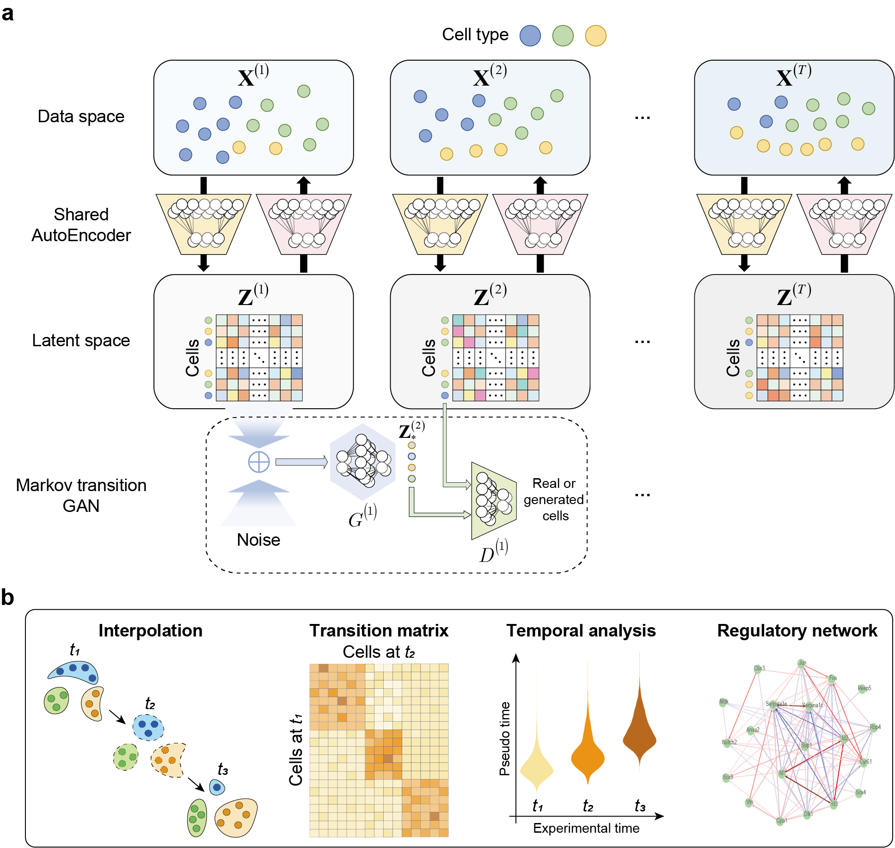

# scMTG: cell state transition and dynamic regulation analysis for single-cell time-series data



## Installation  

```  
Requiements:  
1. Python 3.8 or later version  
2. Packages:  
    tensorflow-gpu (2.6.0)  
    keras (2.6.0)  
    numpy, pandas
  
Package installation:

$ git clone https://github.com//liuq-lab/scMTG.git       
```

## Tutorial
We provide a quick-start notebook for the training, evaluation and analysis of scMTG.


## Contact 
If you have any questions, you can contact me from the email: <cuixj19@tsinghua.org.cn>

